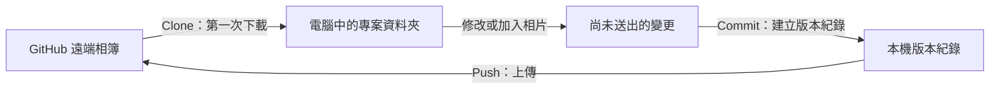
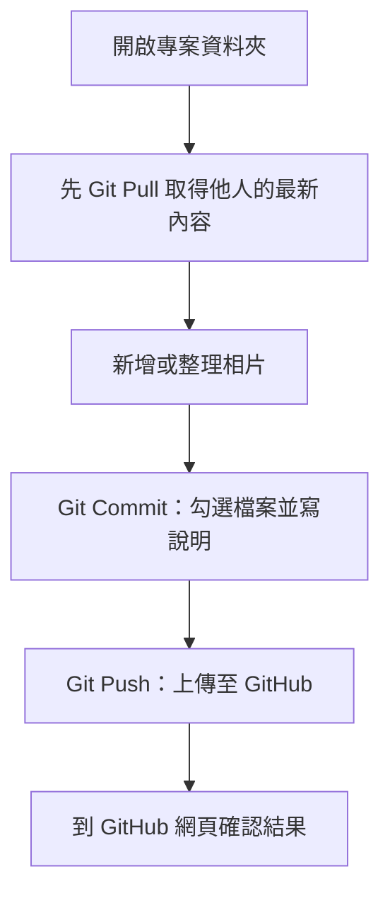

# 班級活動相片庫：TortoiseGit 初學者指南

這份指南適合第一次使用 Git 與 TortoiseGit 的 Windows 使用者。完成後，您可以把相片放入專案、建立版本紀錄，並上傳到 GitHub。

> [!IMPORTANT]
> 本專案的遠端網址是：
> `https://github.com/Bliss-Wisdom-Lamrim-Discussion-Class/class-event-photos.git`

## 先認識三個動作



| 名稱 | 白話說明 | 何時使用 |
| --- | --- | --- |
| **Clone（複製）** | 第一次把 GitHub 上的整個專案下載到電腦 | 第一次取得專案 |
| **Commit（提交）** | 為這次修改建立一筆本機版本紀錄 | 每次整理好一批變更 |
| **Push（推送）** | 將已 Commit 的內容上傳到 GitHub | Commit 後要分享給其他人 |

---

## 1. 安裝 Git 與 TortoiseGit

### 1-1. 安裝 Git for Windows

1. 開啟 [Git for Windows 官方下載頁](https://git-scm.com/download/win)。下載通常會自動開始。
2. 開啟下載的安裝檔，例如 `Git-2.xx.x-64-bit.exe`。
3. 安裝過程中大多數選項可維持預設值，持續按 **Next**。
4. 看到下圖類似的完成畫面時，按 **Finish**。


> Git 是實際記錄檔案版本的工具；TortoiseGit 是讓您可以用滑鼠操作 Git 的 Windows 介面。兩個都需要安裝。

### 1-2. 安裝 TortoiseGit

1. 開啟 [TortoiseGit 官方下載頁](https://tortoisegit.org/download/)。
2. 在 **TortoiseGit** 區塊，下載符合電腦的安裝檔：大多數新電腦請選 **64-bit**。
3. 執行安裝檔，依畫面按 **Next**，最後按 **Install** 與 **Finish**。
4. 建議一併下載該頁的 **Language Packs**，安裝後可在 TortoiseGit 設定中選擇繁體中文介面。
5. 安裝完成後，請在 Windows 檔案總管的空白處按右鍵；看見 **Git Clone...**、**Git Commit ->** 等選單，就表示成功了。

### 1-3. 第一次設定姓名與 Email

Git 會將姓名與 Email 寫在每次 Commit 的作者資訊中。只需設定一次。

1. 在任一資料夾空白處按右鍵，選擇 **TortoiseGit -> Settings**。
2. 在左側選擇 **Git -> Config**。
3. 在 **User Info** 填寫您的姓名（`Name`）與 Email（`Email`）。Email 建議使用您登入 GitHub 的信箱。
4. 按 **Apply**，再按 **OK**。

> 不確定帳號是否已被授予上傳權限嗎？先 Clone 沒有問題；第一次 Push 若遭拒絕，請向專案管理者確認您是否已被加入協作者。

---

## 2. 第一次從 GitHub 下載此專案（Clone）

### 開始前

- 選擇一個容易找到的位置，例如 `文件` 或 `D:\Projects`。
- **不要**在已經有同名 `class-event-photos` 資料夾的地方 Clone；請換一個空白位置。
- 建議不要把專案放進 Dropbox、OneDrive 等會同步檔案的資料夾，以避免同步與 Git 同時修改檔案。

### 操作步驟

1. 開啟檔案總管，進入您要存放專案的**上層資料夾**。
2. 在空白處按右鍵，選擇 **Git Clone...**。
3. 在彈出的視窗中填寫以下資料：

   | 欄位 | 請填寫 |
   | --- | --- |
   | **URL** | `https://github.com/Bliss-Wisdom-Lamrim-Discussion-Class/class-event-photos.git` |
   | **Directory** | 選擇下載位置；通常會自動帶出 `class-event-photos` 資料夾 |
   | **Recursive** | 維持未勾選即可 |

4. 按 **OK**，等待下載完成。首次下載可能需要幾分鐘，請勿關閉視窗。
5. 出現 `Success` 或 `Finished!` 後按 **Close**。您會看到新建立的 `class-event-photos` 資料夾。
6. 進入這個資料夾，在空白處按右鍵。看到 TortoiseGit 選單，即表示這是可管理的 Git 專案。

```text
您選擇的上層資料夾
└─ class-event-photos     ← Clone 完成後產生，請進入這個資料夾工作
   ├─ photos              ← 放入原始相片
   ├─ thumbnails          ← 縮圖
   ├─ index.html
   └─ README.md
```

### 需要登入 GitHub 時怎麼做？

Clone 是公開下載時通常不需要登入。日後第一次 Push 若跳出 GitHub 登入視窗，請依畫面用瀏覽器登入您的 GitHub 帳號並授權；不要把 GitHub 密碼填入普通文字輸入框。成功授權後，Windows 會記住登入資訊。

---

## 3. 用 TortoiseGit 建立 Commit

在 Commit 前，請先確認您已將相片或其他要修改的檔案放進 `class-event-photos` 資料夾內。

### 3-1. 開啟 Commit 視窗

1. 回到 `class-event-photos` 資料夾。
2. 在資料夾空白處按右鍵，選擇 **Git Commit -> "main"...**。
   - 若選單顯示的不是 `main`，請選擇同樣以 **Git Commit ->** 開頭的項目即可。
3. TortoiseGit 會掃描變更並開啟 Commit 視窗。

### 3-2. 勾選檔案並寫 Commit 訊息

在 Commit 視窗，請依序完成：

1. 在下方的檔案清單，**只勾選這次要送出的檔案**。
2. 在上方的 **Message** 方框，寫下這次修改的說明。
3. 確認無誤後，按右下角的 **Commit**。
4. 出現成功訊息後按 **Close**。

```text
Message（範例）
新增 2026-08-14 幸福與智慧課程活動相片

檔案清單
[x] photos/2026-08-14_幸福與智慧課程/IMG_001.jpg
[x] photos/2026-08-14_幸福與智慧課程/IMG_002.jpg
[ ] js/app.js                         ← 沒要送出就不要勾
```

好的 Commit 訊息要能回答「這次做了什麼」：

| 可以這樣寫 | 不建議這樣寫 |
| --- | --- |
| `新增 2026-08-14 班級活動相片` | `修改` |
| `修正首頁相簿標題` | `更新檔案` |
| `移除重複的活動照片` | `test` |

> [!TIP]
> Commit 只會建立在您的電腦上，其他人尚未看得到。要把它上傳到 GitHub，下一步需要 Push。

### 3-3. Commit 後 Push 到 GitHub

1. 在 `class-event-photos` 資料夾空白處按右鍵。
2. 選擇 **TortoiseGit -> Push...**。
3. 確認遠端名稱是 `origin`、分支是 `main`，其餘保留預設值。
4. 按 **OK**。第一次 Push 可能會要求登入 GitHub。
5. 出現 `Success` 後按 **Close**。重新整理 GitHub 專案頁面，就能看到新的 Commit 與檔案。

---

## 每次上傳相片的建議流程



在開始修改前，可先按右鍵選 **TortoiseGit -> Pull...**，按 **OK** 下載其他人已上傳的內容。這個小習慣能大幅減少衝突。

## 常見問題

### 找不到「Git Clone」或「Git Commit」選單

重新啟動檔案總管或電腦後再試。若仍沒有，請確認已安裝 TortoiseGit，而不只是 Git for Windows。

### Push 時出現權限不足（permission denied / 403）

代表您的 GitHub 帳號沒有此專案的寫入權限，或登入了另一個帳號。請向專案管理者申請加入 GitHub 協作者，之後重新 Push。

### Commit 視窗沒有檔案可勾選

請確認檔案真的放在 `class-event-photos` 裡面，而不是放在外層的下載資料夾。也可按 Commit 視窗的重新整理按鈕再次掃描。

### 不小心 Commit 了，不想上傳怎麼辦？

只要還沒有 Push，其他人看不到這筆紀錄。請先不要 Push，並向熟悉 Git 的管理者確認後續處理方式；不要隨意使用「Reset」或「Rebase」，以免遺失檔案。

## 官方參考資料

- [Git for Windows 官方網站](https://git-scm.com/download/win)
- [TortoiseGit 官方下載頁](https://tortoisegit.org/download/)
- [TortoiseGit：Clone 文件](https://tortoisegit.org/docs/tortoisegit/tgit-dug-clone.html)
- [TortoiseGit：Commit 文件](https://tortoisegit.org/docs/tortoisegit/tgit-dug-commit.html)